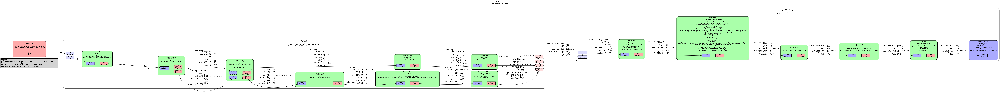

# An example of using DeepStream SDK for redaction #

<p align="center">
  
</p>

The example shows how to use DeepStream SDK 6.1 for redacting faces and license plates in video streams.

The example uses ResNet-10 to detect faces and license plates in the scene on a frame by frame basis. The detected faces and license plates are then automatically redacted. The image composited with the resulting frames can be displayed on screen or be encoded to an MP4 file by the choice of user. The example runs on both NVIDIA dGPUs as well as NVIDIA jetson platforms. The example demonstrates the use of the following plugins of the DeepStream SDK – nvv4l2decoder, nvvideoconvert, nvinfer and nvdsosd.

Note that the networks in the examples are trained with limited datasets. These networks should be considered as sample networks to demonstrate the use of plugins in the DeepStream SDK 6.0, to create a redaction application. Developers should train their networks to achieve the level of accuracy needed in their applications.

---


### Pre-requisites: ###

- [DeepStream SDK 6.1](https://developer.nvidia.com/deepstream-sdk)

### Installing Pre-requisites: ###

Download and install DeepStream SDK 6.1

1. Click `Download` from [NVIDIA Deepstream SDK home page](https://developer.nvidia.com/deepstream-sdk), then select `DeepStream 6.1 for T4 and V100` if you work on NVIDIA dGPUS or select `DeepStream 6.1 for Jetson` if you work on NVIDIA Jetson platforms.

2. Login to NVIDIA Developer account.

3. Agree to the terms of license agreement and download DeepStream SDK 6.1.

4. Follow the installation instructions in the README in the downloaded tar file.

5. Run the samples following the instructions in the README file to make sure that the DeepStream SDK has been properly installed on your system.

### The Redaction App Pipeline Description ###

The Redaction pipeline implements the following steps:

* Decode the mp4 file or read the stream from a webcam (tested with C920 Pro HD Webcam from Logitech).

* Detect faces and license plates using the networks provided. The “nvinfer” plugin uses the TensorRT for performing this detection. 

* Draw colored rectangles with solid fill to obscure the faces and license plates and thus redact them. The color can be customized by changing the corresponding RBG value in `deepstream_redaction_app.c` (line 100 - 107, line 109 - 116).

* Display the frames on screen or encode the frames back to an mp4 file and then write the file to disc.

* User can choose to ouput supplementary files in KITTI format enumerating the bounding boxes drawn for redacting the faces and license plates. This will be needed for manual verification and rectification of the automated redaction results.

The application pipeline is shown below:




The application will output its pipeline to the folder `DOT_DIR` by specifying the environment variable `GST_DEBUG_DUMP_DOT_DIR=DOT_DIR` when running the app.
One can generate the pipeline by using the following command:

`dot -Tpng DOT_DIR/<.dot file> > pipeline/pipeline.png`

A sample output video can be found in folder `sample_videos`.

### Running the Redaction App ###

1. Downloading the application

`cd <path-to-deepstream-sdk>/sources/apps` & git clone command & `cd redaction_with_deepstream`

(if you want to use it with Deepstream 3.0, do `$ git checkout 324e34c1da7149210eea6c8208f2dc70fb7f952a`)

2. Building the application

	`sudo make`

3. Running the application

	```
	./deepstream-redaction-app -c <path-to-config-file> 
							  [-i <path-to-input-mp4-file> 
							   -o <path-to-output-mp4-file> 
							   -k <path-to-output-kitti-folder>]
	```

  By default, app tries to run `/dev/video0` camera stream. Use `-i` option to use file stream.

	run `./deepstream-redaction-app --help` for detailed usage.

